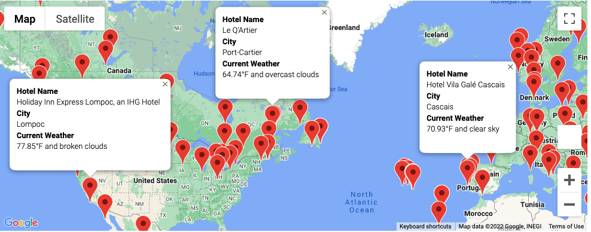
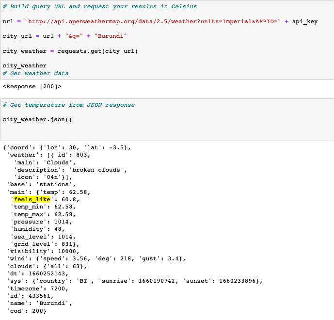
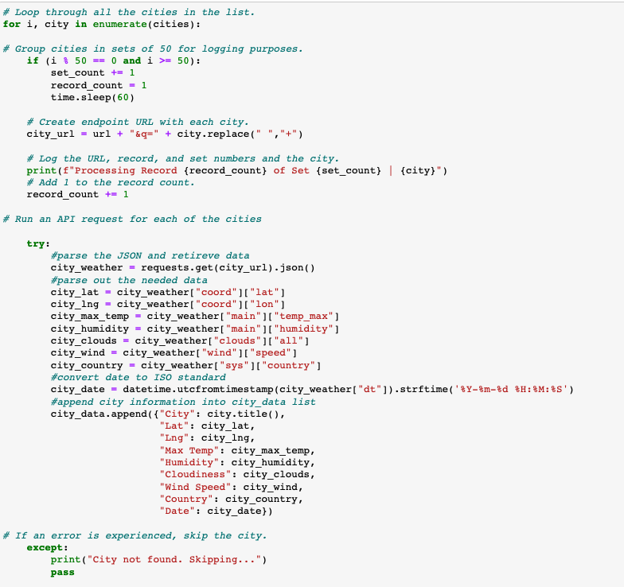
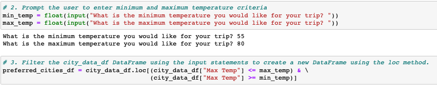
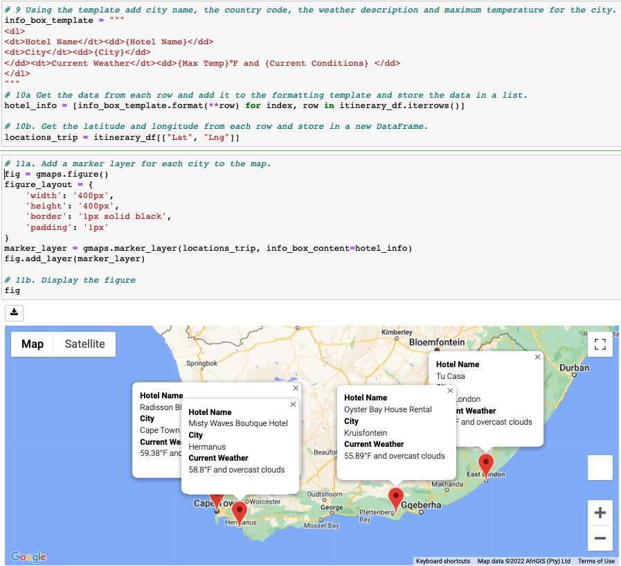
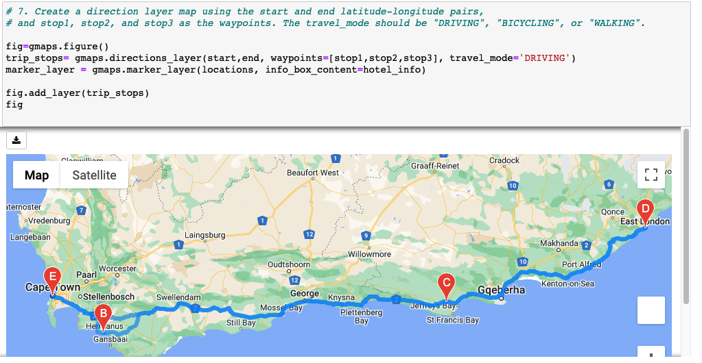

# World_Weather_Analysis

# Overview

This project uses Python to pull Application Programming Interface (API)  requests from open source tools to bring queries to life.  Imagine a hypothetical travel company PlanMyTrip that allows customers to search hotels based on their preferred weather and find a curated list of hotels all around the world on google maps with directions for a full travel itinerary built-in! 

# Results

First, we examine the raw `JSON` array that is retrieved from an API call to OpenWeatherMap to get specific real-time information.  In this case, we can specify the term `feels_like` in our request. 

Using a for loop, we can search from thousands of randomly generated locations and parse out only the information we want to present to customers and put them into a data frame.  Since there may be errors retrieving data from such a large list of randomly generated locations,  the `try: except:` function is added to the block of code to mitigate errors.  

Next, the customer is able to enter their ideal maximum and minimum temperature for their trip.  This information is used to create a new data frame of their ideal cities.  Using google’s developer services, we can use the latitude and longitude of each city to find nearby hotels with detailed information.

The final addition is to allow customers to add multiple locations based on their search criteria and add directions using the Google Maps directions API service to plan a full vacation itinerary for their trip.  

